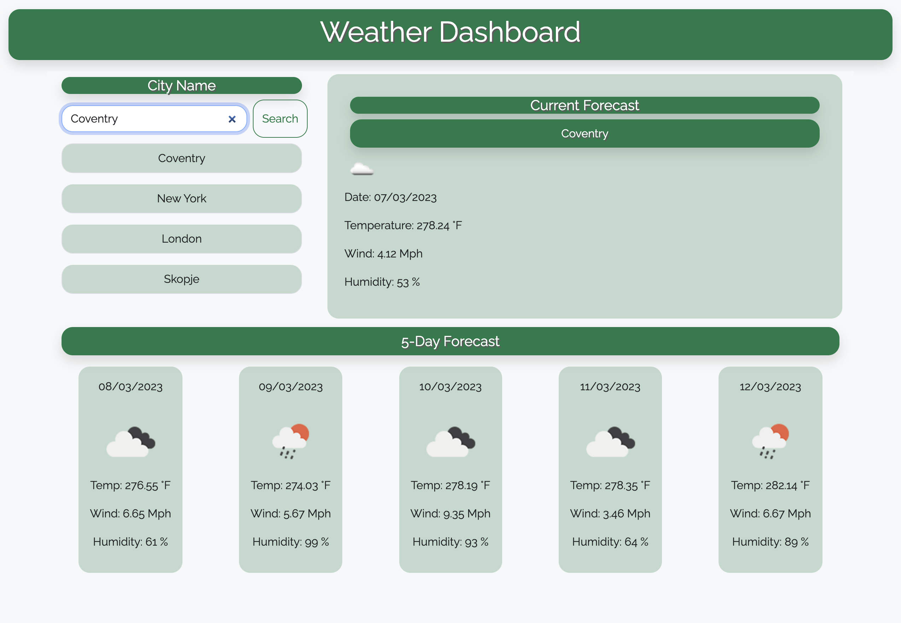

# WeatherApp

This website allows users to search for the current weather and 5-day forecast for any city. Users can view the current temperature, wind speed, and humidity, as well as a detailed forecast for the next five days.

## How to Use

To use the website, simply enter the name of the city you would like to search for in the search bar at the top of the page. The website will automatically display the current weather conditions for that city, including the temperature, wind speed, and humidity.

To view the 5-day forecast, simply scroll down on the page. The forecast will show the predicted temperature, wind speed, and humidity for each of the next five days.

## Data Sources

The weather data used on this website is provided by OpenWeatherMap. The website retrieves the data through the OpenWeatherMap API.

## Technologies Used

This website was built using HTML, CSS, and JavaScript. The website also uses the Bootstrap framework for styling and layout.

## Links

- Website
  https://kristiyantefov.github.io/WeatherApp/

- Repo
  https://github.com/kristiyantefov/WeatherApp

## Mock-Up

